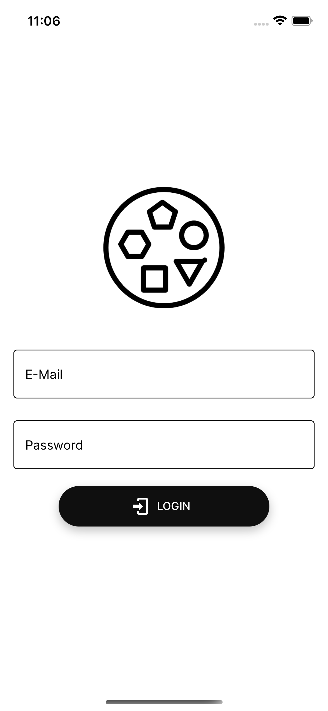
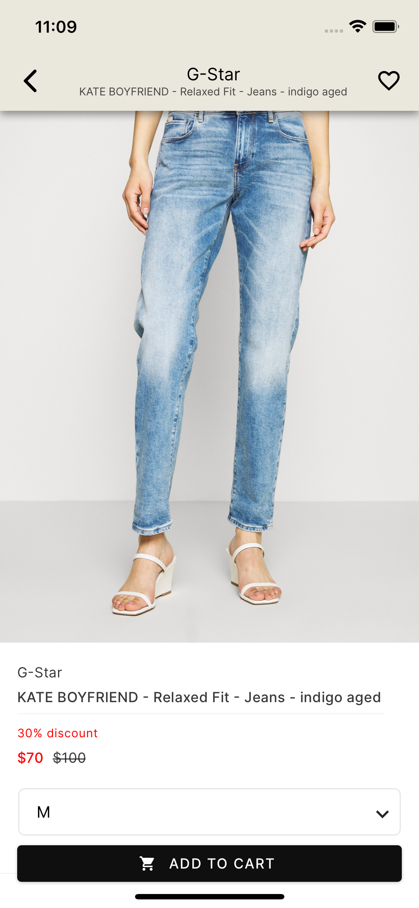
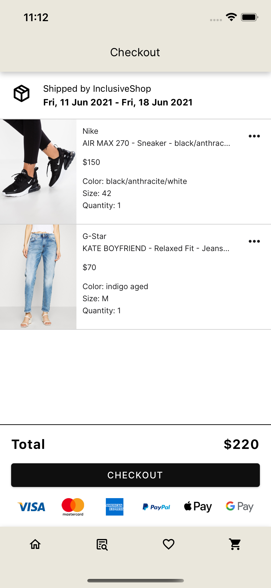

# Inclusive Shop

## General Information
### What

This project is an offline shop demonstrating common a11y techniques. The app design is inspired by [Zalando](https://www.zalando.com/).

### Why

The goal of this project is to highlight techniques regarding a11y and moreover Inclusive Design in the realm of React Native. It is also the project for my thesis. The corresponding paper will be published later.

### How

- [React Native CLI](https://reactnative.dev/docs/environment-setup)
- [React Navigation](https://reactnavigation.org/)
- [React Native Paper](https://callstack.github.io/react-native-paper/)
- [Native Base v3](https://alpha.nativebase.io/docs/nativebase)
- [Material Design](https://material.io/design/usability/accessibility.html#understanding-accessibility)

### Out of Scope

> Due to limited time, the following topics are out of scope, but should be deeply considered in real-life projects!

- Testing
- Internationalization (i18n)

### Sample Screens





## Common React Native Accessibility APIs Used

> Screen reader capabilities tested with TalkBack on an OnePlus 6T using Android 10

- [Accessibility API](https://reactnative.dev/docs/accessibility)
  - `accessibilityLabel`
  - `accessibilityHint`
  - `acceesibilityRole`
  - `accessibilityState`
  - `accessibilityIgnoresInvertColors`
  - `accessibilityElementsHidden`
  - `importantForAccessibility`
- [AccessibilityInfo API](https://reactnative.dev/docs/accessibilityinfo)
  - `isScreenReaderEnabled`
  - `setAccessibilityFocus`

## Color Contrast

> [Understanding WCAG 2 Contrast and Color Requirements
](https://webaim.org/articles/contrast/)

```ts
const theme = {
  // ...
  colors: {
    // ...
    primary: "#EAE7DC",
    accent: "#0F0F0F",
    background: "#FFFFFF",
  },
  // ...
};
```

- Primary Background + Accent Foreground = [Contrast Ratio of 15.48:1](https://color.a11y.com/ContrastPair/?bgcolor=EAE7DC&fgcolor=0F0F0F)
- White Background + Accent Foreground = [Contrast Ratio of 19.16:1](https://color.a11y.com/ContrastPair/?bgcolor=FFFFFF&fgcolor=0F0F0F)
- All combinations pass WCAG AA and WCAG AAA

## Fonts

> https://webaim.org/techniques/fonts/

This project uses the [Inter font family](https://rsms.me/inter/). It is designed for increased readability on computer screens and especially on smaller screens like smartphones for example.

## Font Scaling

> All screens should have the ability to deal with large system fonts

- You can make use of APIs like
  - [`maxFontSizeMultiplier`](https://reactnative.dev/docs/text#maxfontsizemultiplier)
  - [`PixelRatio.getFontScale()`](https://reactnative.dev/docs/pixelratio#getfontscale)
  - [`PixelRatio.getPixelSizeForLayoutSize(layoutSize: number)`](https://reactnative.dev/docs/pixelratio#getpixelsizeforlayoutsize)

## Forcing Focus for Accessibility

> Sometimes you have to force focus to a specific element. E.g. entering or leaving a modal

You make use of `useRef` and pass that to the desired view. Afterwards, in your handler, you combine the usage of `findNodeHandle` and `AccessibilityInfo.setAccessibilityFocus` in order to set the focus. The ref value is passed to `findNodeHandle`, which should return the reactTag that you then need to pass to `setAccessibilityFocus`. The latter API doesn't work reliably as it should. You can read on [Recognized Issues](#recognized-issues) why.

## Tooling

- [eslint-plugin-react-native-a11y](https://github.com/FormidableLabs/eslint-plugin-react-native-a11y)

## Recognized Issues

- There were cases where the screen reader would just ignore `accessibilityLabel`. It would constantly start reading `accessibilityHint` first.
- Handling focus programmatically is a hard task and not really stable as it seems. You need to call `setAccessibilityFocus` multiple times to force the focus. Read [this issue](https://github.com/facebook/react-native/issues/30097) for further information.
- Usually you have a11y APIs that support collections. There are currently open issues for that [[1]](https://github.com/facebook/react-native/issues/30977) [[2]](https://github.com/facebook/react-native/issues/30972). You can kind of realize this in a hacky way by passing down the collection size and index of elements via props an make it announcable via `accessibilityLabel` and `accessibilityHint`. 
- [Not all standard roles and traits are supported](https://github.com/facebook/react-native/issues/30839)
- [RN is currently missing an API for accessibility order, which hurts UX](https://github.com/facebook/react-native/issues/30888)
- Modal a11y was weird, so I had to come up with different UI designs in order to prevent negative UX. May be related to [this issue](https://github.com/facebook/react-native/issues/30860).